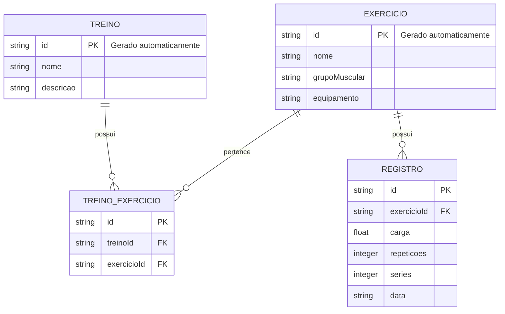

# 🛠️ Especificação Técnica (Architecture) - GRIP

Este documento detalha a arquitetura técnica, o modelo de dados e os contratos de API (via JSON Server) necessários para o funcionamento do sistema GRIP.

## 1. Modelo de Dados (Diagrama ER)

Abaixo está o Diagrama Entidade-Relacionamento (DER) que representa a estrutura do nosso banco de dados (`db.json`) e como as informações se conectam.



## 2. Dicionário de Dados

Breve explicação das entidades principais:

* **Exercícios:** Responsável por armazenar os exercícios cadastrados pelo usuário.

  * `id`: Identificador único do exercício.
  * `nome`: Nome do exercício.
  * `grupoMuscular`: Grupo muscular trabalhado.
  * `equipamento`: Equipamento utilizado no exercício.

* **Treinos:** Responsável por armazenar os treinos criados pelo usuário.

  * `id`: Identificador único do treino.
  * `nome`: Nome do treino.
  * `descricao`: Descrição do treino.

* **Registros:** Armazena o desempenho do usuário durante os exercícios.

  * `id`: Identificador único do registro.
  * `exercicioId`: Identificador do exercício realizado.
  * `carga`: Peso utilizado no exercício.
  * `repeticoes`: Número de repetições realizadas.
  * `series`: Número de séries realizadas.
  * `data`: Data em que o exercício foi realizado.

* **Treino_Exercicio:** Responsável por relacionar exercícios aos treinos.

  * `treinoId`: Identificador do treino.
  * `exercicioId`: Identificador do exercício.

**Regra de Negócio Crítica:** Ao registrar uma nova carga em um exercício, o sistema compara o valor com o maior registro anterior. Caso a nova carga seja maior, o sistema identifica o registro como um novo PR.

## 3. Rotas da API (JSON Server)

A aplicação consome uma API local simulada pelo JSON Server. Abaixo os principais endpoints:

* `GET /exercicios` - Retorna a lista de exercícios.
* `POST /exercicios` - Cadastra um novo exercício.
* `GET /treinos` - Retorna a lista de treinos.
* `POST /treinos` - Cadastra um novo treino.
* `GET /registros?exercicioId=1` - Retorna os registros de um exercício específico.
* `POST /registros` - Cadastra um novo registro de desempenho.

## 4. Estrutura do Banco de Dados (`db.json`)

Esta é a representação em formato JSON do banco de dados simulado. Esta estrutura serve de contexto para ferramentas de IA e para o JSON Server inicializar a API Fake.

```json
{
    "exercicios": [
        {
            "id": "1",
            "nome": "Supino reto",
            "grupoMuscular": "Peito",
            "equipamento": "Barra"
        },
        {
            "id": "2",
            "nome": "Rosca direta",
            "grupoMuscular": "Bíceps",
            "equipamento": "Barra"
        }
    ],
    "treinos": [
        {
            "id": "1",
            "nome": "Treino A",
            "descricao": "Peito e tríceps"
        }
    ],
    "treinoExercicios": [
        {
            "id": "1",
            "treinoId": "1",
            "exercicioId": "1"
        }
    ],
    "registros": [
        {
            "id": "1",
            "exercicioId": "1",
            "carga": 80,
            "repeticoes": 10,
            "series": 4,
            "data": "2026-08-25"
        }
    ]
}
```

