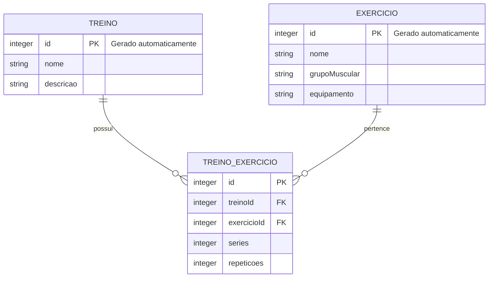

# 🛠️ Especificação Técnica (Architecture) - GRIP

Este documento detalha a arquitetura técnica, o modelo de dados e os contratos de API (via JSON Server) necessários para o funcionamento do sistema GRIP.

## 1. Modelo de Dados (Diagrama ER)

Abaixo está o Diagrama Entidade-Relacionamento (DER) que representa a estrutura do nosso banco de dados (`db.json`) e como as informações se conectam.



## 2. Dicionário de Dados

Breve explicação das entidades principais:

* **Exercícios:** Responsável por armazenar os exercícios disponíveis no sistema.

  * `id`: Identificador único do exercício.
  * `nome`: Nome do exercício.
  * `grupoMuscular`: Grupo muscular trabalhado.
  * `equipamento`: Equipamento utilizado no exercício.

* **Treinos:** Responsável por armazenar os treinos criados pelo usuário.

  * `id`: Identificador único do treino.
  * `nome`: Nome do treino.
  * `descricao`: Descrição do treino.

* **Treino_Exercicio:** Responsável por relacionar os exercícios aos treinos e armazenar as configurações específicas de cada exercício dentro do treino.

  * `id`: Identificador único da relação.
  * `treinoId`: Identificador do treino.
  * `exercicioId`: Identificador do exercício.
  * `series`: Quantidade de séries definidas para o exercício.
  * `repeticoes`: Quantidade de repetições definidas para o exercício.

**Regra de Negócio:** Um treino pode possuir vários exercícios e um exercício pode estar presente em vários treinos. As séries e repetições são definidas especificamente para cada exercício dentro de cada treino.

## 3. Rotas da API (JSON Server)

A aplicação consome uma API local simulada pelo JSON Server. Abaixo estão os principais endpoints:

* `GET /exercicios` - Retorna a lista de exercícios.
* `GET /exercicios?grupoMuscular=Bíceps` - Retorna os exercícios de um determinado grupo muscular.
* `POST /exercicios` - Cadastra um novo exercício.
* `GET /treinos` - Retorna a lista de treinos.
* `GET /treinos/1` - Retorna um treino específico.
* `POST /treinos` - Cadastra um novo treino.
* `GET /treinoExercicios?treinoId=1` - Retorna os exercícios associados a um treino.
* `POST /treinoExercicios` - Associa um exercício a um treino, incluindo séries e repetições.

## 4. Estrutura do Banco de Dados (`db.json`)

Esta é a representação em formato JSON do banco de dados simulado. Esta estrutura serve de contexto para ferramentas de IA e para o JSON Server inicializar a API Fake.

```json
{
    "exercicios": [
        {
            "id": 1,
            "nome": "Supino reto",
            "grupoMuscular": "Peito",
            "equipamento": "Barra"
        },
        {
            "id": 2,
            "nome": "Rosca direta",
            "grupoMuscular": "Bíceps",
            "equipamento": "Barra"
        },
        {
            "id": 3,
            "nome": "Rosca martelo",
            "grupoMuscular": "Bíceps",
            "equipamento": "Halteres"
        }
    ],
    "treinos": [
        {
            "id": 1,
            "nome": "Treino A",
            "descricao": "Peito e Tríceps"
        }
    ],
    "treinoExercicios": [
        {
            "id": 1,
            "treinoId": 1,
            "exercicioId": 1,
            "series": 4,
            "repeticoes": 10
        }
    ]
}
```

## 5. Versões das Tecnologias

As versões abaixo definem as tecnologias utilizadas na implementação do sistema GRIP.

* **Bootstrap:** v5.3.3
* **jQuery:** v3.7.1
* **JSON Server:** v1.0.0-beta.15
* **Wger API:** v2
* **JavaScript:** ES6+
* **HTML:** HTML5
* **CSS:** CSS3

### Justificativa

O registro das versões exatas das tecnologias busca garantir compatibilidade e previsibilidade durante o desenvolvimento do projeto. Essa especificação também serve como referência para ferramentas de Inteligência Artificial, como Cursor e GitHub Copilot, permitindo que o código seja gerado considerando corretamente as classes, métodos e recursos disponíveis nas versões utilizadas.
